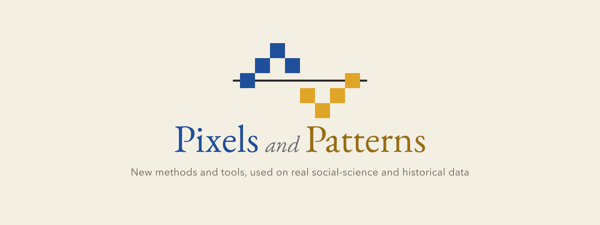

<div align="center">



# Replication materials

[](LICENSE)
[](https://pixelsandpatterns.substack.com)
[](posts)

**Code, data, and figures behind the posts at [Pixels and Patterns](https://pixelsandpatterns.substack.com).**

</div>

## What this is

[Pixels and Patterns](https://pixelsandpatterns.substack.com) is a Substack on new methods, new technologies, and their application to empirical social science and digital humanities, written by **Steven Denney** (the *Patterns* beat) and **Aron van de Pol** (the *Pixels* beat). Each post takes something recent, a paper, a model, or a tool, and uses it on real data.

This repository collects the replication materials for those posts. Every post that ships gets a folder under [`posts/`](posts) holding its analysis code, the data behind it, the figures it shows, and the post text itself. The repository grows one post at a time and is meant to hold many.

## Repository structure

```
pixels-and-patterns/
├── assets/                       # brand marks (banner, emblem, wordmark, favicon)
├── posts/
│   └── coethnic-cross-national/  # "Which nation is the exception depends on the estimator"
│       ├── README.md             # what the post does, how to reproduce it
│       ├── code/                 # R + Python analysis and presentation scripts
│       ├── data/
│       │   ├── derived/          # aggregates behind every table and figure (no PII)
│       │   └── microdata/        # de-identified respondent-level choice data
│       ├── figures/              # the figures the post shows
│       └── post/                 # the post source (Markdown) and a self-contained HTML
├── LICENSE                       # CC BY 4.0
└── README.md                     # this file
```

## Posts

| Post | Beat | Author | Folder |
|---|---|---|---|
| Which nation is the exception depends on the estimator | Patterns | Steven Denney | [`posts/coethnic-cross-national`](posts/coethnic-cross-national) |

## Data and privacy

Posts ship aggregates, model output, and figures by default. Where respondent-level data is released, it is **de-identified**: survey response identifiers are replaced with sequential integers and only the columns needed to reproduce the analysis are kept. See each post's `data/README.md` for provenance and the de-identification log. Raw survey exports are not distributed here.

## License

Content is released under [CC BY 4.0](LICENSE). You may share and adapt the materials with attribution to the authors and a link to [Pixels and Patterns](https://pixelsandpatterns.substack.com).
